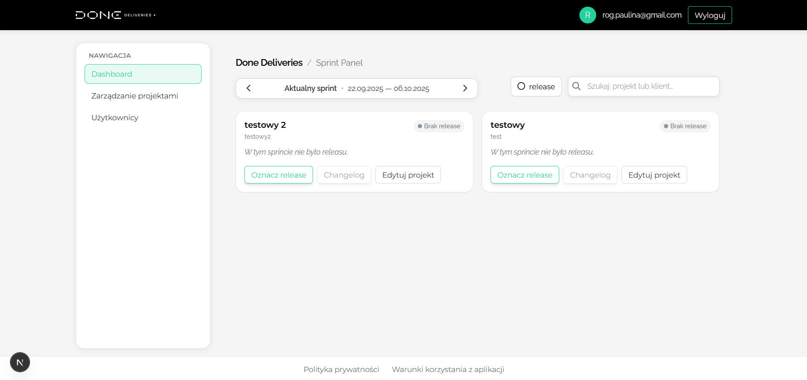
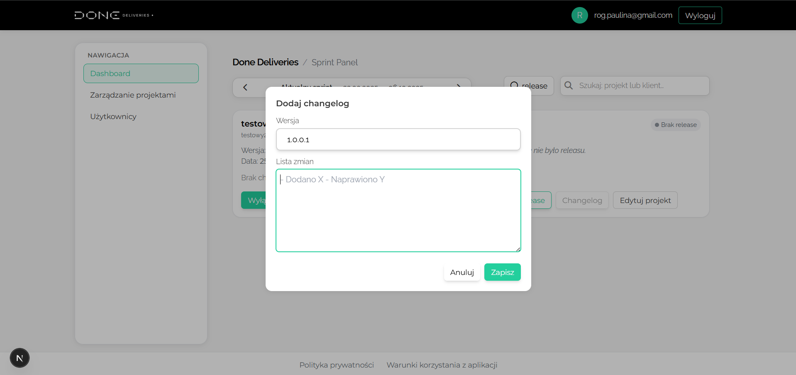
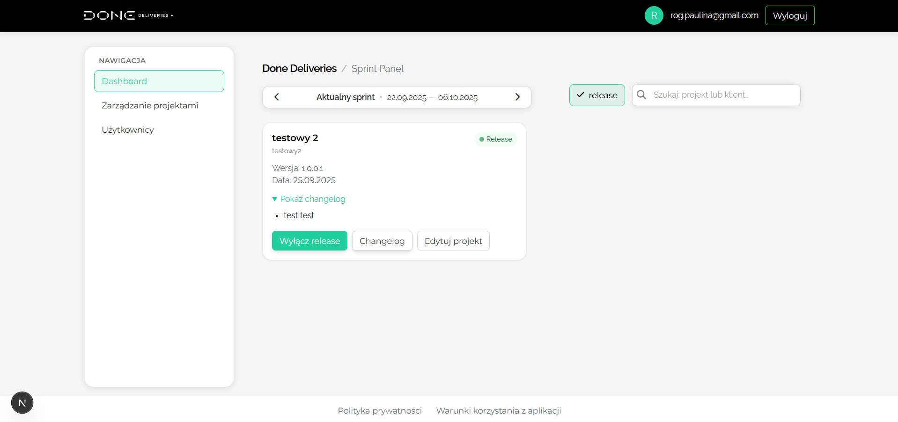
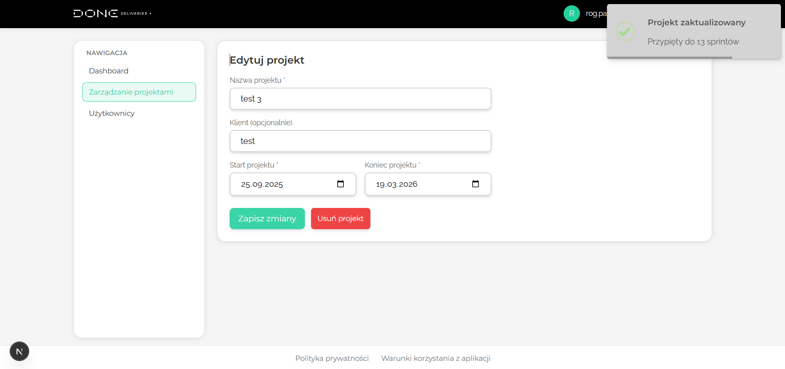
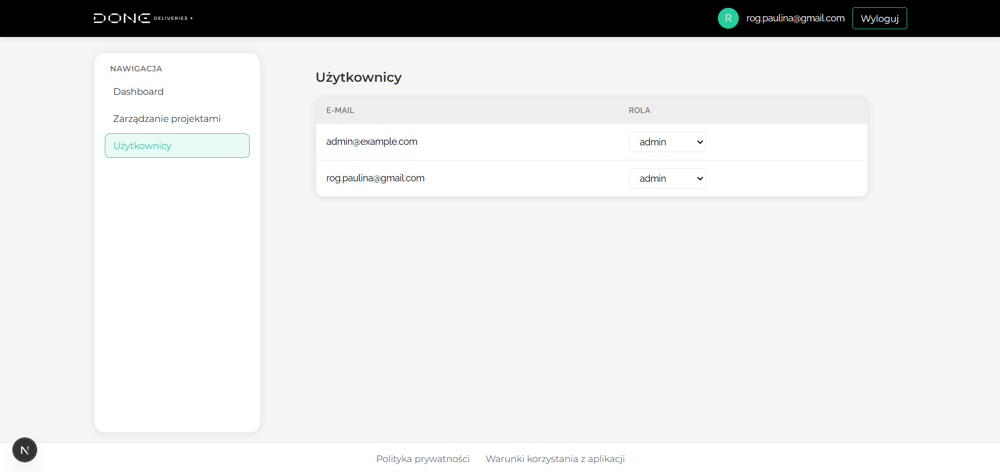

# Done Deliveries / Sprint Panel

**Done Deliveries / Sprint Panel** is a web application for managing projects and sprints. It streamlines collaboration between administrators, managers, and stakeholders by offering secure role-based access, intuitive sprint dashboards, and clear communication tools. The platform helps to stay organized and informed.

---

## Tech Stack

**Frontend**
- Next.js
- TypeScript
- Tailwind CSS

**Backend / Services**
- Supabase
- PostgreSQL (via Supabase)

**Authentication & Security**
- Supabase Auth with role-based access
- Cookies-based session handling

**Build & Deployment**
- Node.js environment

---

## Installation & Setup

Follow the steps below to run the project locally.

### 1. Clone the repository
```bash
git clone https://github.com/your-org/your-repo.git
cd your-repo
```

### 2. Install dependencies

```bash
npm i
```

### 3. Configure environment variables

Create a .env.local file in the project root and add your Supabase credentials:

```env
NEXT_PUBLIC_SUPABASE_URL=your-supabase-url
NEXT_PUBLIC_SUPABASE_ANON_KEY=your-supabase-anon-key
```

### 4. Run the development server

```bash
npm run dev
```

---

## Key Features

- **User Accounts & Roles**  
  Secure registration and login system.  
  Admins, managers, and stakeholders each get a tailored view.

- **Project & Sprint Management**  
  Organize projects into sprints.  
  Navigate between past, current, and upcoming sprints and filter projects by release.
  Search for projects by project name or client.

- **User Management**  
  Administrators can manage user accounts and assign roles.

- **Legal & Compliance**  
  Dedicated pages for the Privacy Policy and Terms of Use.

---

## API Overview

The application uses a data access layer built on top of **Supabase**.  
Below are the core API functions and their purpose.

### User & Role
- `getUser` → returns the currently authenticated user
- `getMyRole` → returns the numeric role ID of the logged-in user

### Sprint Management
- `getCurrentSprint` → fetches the current sprint for a given date
- `getPrevSprint` → retrieves the sprint before the given one
- `getNextSprint` → retrieves the sprint after the given one

### Project & Cards
- `getCardsForSprint` → Returns all project cards for the selected sprint with optional filters:
  - `q` → search query
  - `releaseOnly` → filter by release flag

---

## Screenshots

Sneak peak into admin panel and it's functions

#### Main view

<p align="center">
  
</p>

#### Adding changelog/release

<p align="center">
  
</p>

#### Projects filtered by release

<p align="center">
  
</p>

#### Editing project

<p align="center">
  
</p>

#### Role management

<p align="center">
  
</p>

## Project Roadmap

Planned enhancements and upcoming features:

### UI / UX
- Dark mode / light mode toggle  
- Intuitive project notes and comment system (stakeholder notes + developer feedback)  

### User & Stakeholder Features
- Dedicated stakeholder accounts with default filtering (stakeholders see only their own projects)  
- Ability for stakeholders to leave feedback
- Display assigned team members for each project with contact options (via email)

### Admin & Permission Management
- Extended user management (ban and delete accounts)  
- Two-Factor Authentication (2FA)  

### Communication & Notifications
- Email notifications for stakeholders when a new release is published  

### Data & File Management
- Upload images/screenshots to changelogs  
- Export project data to CSV  

### Internationalization
- Multi-language support (i18n)  

